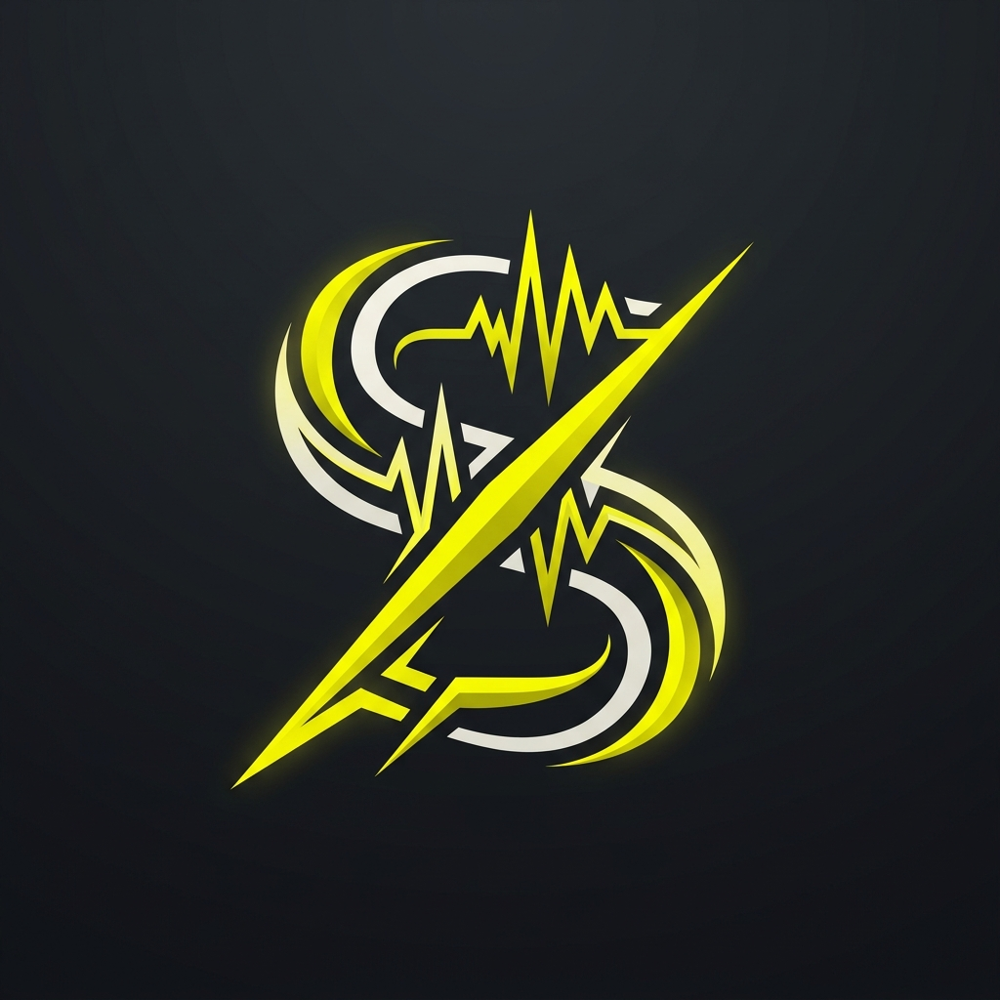

# Stinger — USB Audio Soundboard
<p align="center">
  
</p>

<p align="center">
  <strong>High-performance, ultra-low latency audio workstation powered by ESP32-S3.</strong>
</p>

<p align="center">
  
  
  
  
</p>

---

**Stinger** is a professional-grade USB Audio Soundboard and interface designed for creators, streamers, and audio enthusiasts. Built on the **ESP32-S3** and the **ES8388 Audio Codec**, it combines a high-fidelity sound engine with a modular, tactile hardware interface.

## ✨ Key Features

- **🚀 Professional Audio Engine**: 16-bit / 48kHz PCM playback with sub-10ms trigger latency.
- **🎹 5×5 Matrix Input**: 25 tactile keys with integrated **1N4148 ghosting protection** for complex multi-key triggers.
- **📟 Sharp UI**: 2.9" E-Paper display (296x128) providing high-contrast bank indicators, labels, and real-time status.
- **🔊 Dual Rotary Encoders**: Dedicated physical controls for **System Bank Switching** and **SD Gain Leveling**.
- **💾 PSRAM Powered**: High-speed pre-loading of audio samples (up to 30s) into 8MB PSRAM for instantaneous playback.
- **🏗️ Modular Architecture**: Unique "Hinge" design with a specialized **Brain PCB** (SMT) and a hand-soldered **Plate PCB** (UI).
- **🔄 Auto-Sync Master Pin Map**: Smart build system that ensures hardware schematics and firmware constants are always in sync.

---

## 🏗️ Hardware Architecture: The "Long-Strap" Console

Stinger utilizes a modular **Two-Board Hinge** design to optimize signal integrity and mechanical stability.

- **Brain PCB (Base):** Optimized for signal integrity. Houses the ESP32-S3, high-fidelity ES8388 Codec, MicroSD slot, and power management.
- **Plate PCB (Interface):** Designed for manual assembly. Houses the 25-button MX-style matrix and the E-paper display.
- **Interconnect:** High-density 14-pin IDC ribbon headers connect the two layers, providing a robust electronic and mechanical bond.

> [!IMPORTANT]
> For full technical requirements, BOM, and assembly guides, see the [Hardware Specification](hardware/HARDWARE_SPEC.md).

---

## ⚙️ Firmware Stack: 3-Layer Architectural Model

Built on **ESP-IDF v6.0**, the firmware follows a strict 3-layer model to ensure long-term maintainability and performance:

1.  **Layer 1 (Drivers):** Low-level I2C/I2S/SPI drivers for the ES8388, E-Paper, and Matrix.
2.  **Layer 2 (Middleware):** High-level services for Audio Mixing (3-stream), SD management (with mutex protection), and USB UAC1/MSC stacks.
3.  **Layer 3 (Application):** The "Brain" of Stinger, coordinating state transitions, bank switching, and user event mapping.

> [!TIP]
> Check out the [Firmware Specification](firmware/stinger/FIRMWARE_SPEC.md) for task maps and concurrency details.

---

## 🚀 Getting Started

Ready to build your own Stinger? Follow these steps:

1.  **Clone the Repository:** `git clone https://github.com/mndxc/Stinger.git`
2.  **Environment Setup:** Follow the [GETTING_STARTED.md](GETTING_STARTED.md) guide.
3.  **Build & Flash:** 
    ```bash
    idf.py set-target esp32s3
    idf.py build
    idf.py flash monitor
    ```

---

## 📂 Repository Layout

```text
Stinger/
├── SPEC.md            # Master Project Overview & Master Pin Contract
├── hardware/          # KiCad design files, BOM, & Fabrications
├── firmware/          # ESP-IDF v6.0 source code & build tools
│   └── stinger/       # Main application logic
├── tools/             # Python utilities for pin-gen and audio prep
├── assets/            # Bitmap fonts, icons, and sample packs
└── build/             # Compiled artifacts (Git ignored)
```

---

## 📜 License

Distributed under the GNU General Public License v3.0. See `LICENSE` for more information.

**Project Lead:** [JP+](https://github.com/jonathanpool) | **Version:** 1.9 (Architectural Alignment)
